# Socket大作业

#### 1. 主题

基于 UDP实现一种可靠的传输层协议（STP）

#### 2. 小组情况

| 职务 |  姓名  |   学号    |
| :--: | :----: | :-------: |
| 组长 | 代宜见 | 191250021 |
| 组员 | 周化宇 | 191250213 |
| 组员 | 夏泽霖 | 191250156 |
| 组员 | 罗雪瑾 | 191250102 |
| 组员 |  唐萁  | 191250132 |

#### 3. 功能要求

1. 使用类似 TCP的 handshake机制建立和断开连接
2. 单工，连接分发送方和接收方，接收方除必要的控制报文外不应发送数据报文，发送的数据应是字节流而非字符流
3. 需能配置 STP报文的最大分段大小（MSS）
4. 传输按固定窗口方式进行，只有当窗口中每个数据包都确认传达，才可发送下一个窗口的数据包，最大窗口大小 MWS需能配置，可逐包确认（不必如 TCP中只确认连续数据包的最后一个可用数据包）
5. 需模拟数据包丢失、乱序、超时、出错的情况（如根据概率随机“丢失” 数据包）
6. 需模拟确认包丢失、乱序、超时的情况

#### 4. 项目代码说明

##### STP报文类

- header长度固定为13字节

|   字节   |                        内容                         |
| :------: | :-------------------------------------------------: |
|   [0]    | 包含标志位 第一位为SYN 第二位是FIN 剩余六位暂时闲置 |
| [1]~[4]  |                      32位的seq                      |
| [5]~[8]  |                      32位的ack                      |
| [9]~[12] |                      32位的MSS                      |

- 在握手请求和响应的报文中，SYN为true，FIN为false；
- 在数据发送报文中，SYN与FIN均为false；
- 在断开请求的报文中，SYN为false，FIN为true。
- 每个发送端收到的响应的ack对应顺序发送的下一个报文的seq

##### 运行过程

- sender发送握手请求
- receiver收到握手请求、发送握手响应
- sender开始发送报文，窗口中所有报文都收到响应报文后，移动到下一个窗口，之后每一次接收报文是都判断缓存中的报文是否要写入文件
- receiver收到报文后，发送响应，如果是按照顺序收到，就写入文件，否则放入缓存
- sender没有按时收到响应时（包含丢包情况的处理），重发报文，达到最大重发次数时，如果还没有收到响应，断开连接
- 文件传输完毕后，sender发送断开连接请求, receiver发送断开响应，结束连接

#### 5. 操作说明

1. 启动Receiver，在终端输入java Receiver [接收端口] [存储文件名]
2. 启动Sender，发送文件，另开一个终端窗口，输入java Sender [目的主机ip] [目的端口] [发送文件名] [MSS] [丢包率]
3. 通过控制台查看发送情况
4. 接受与发送文件保存在resource文件夹中

#### 6.运行效果

##### 正常发送

- 接收端

  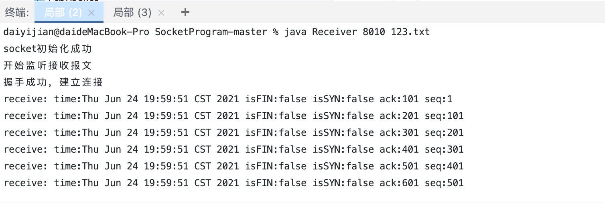

  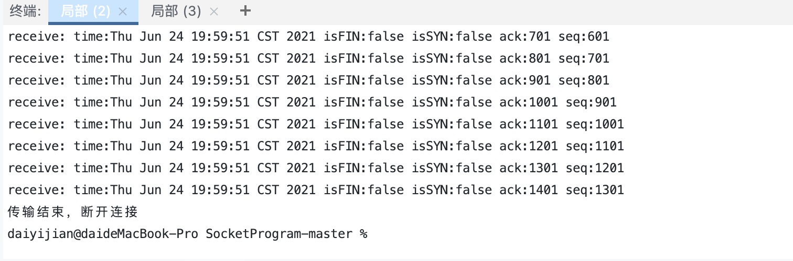

- 发送端

  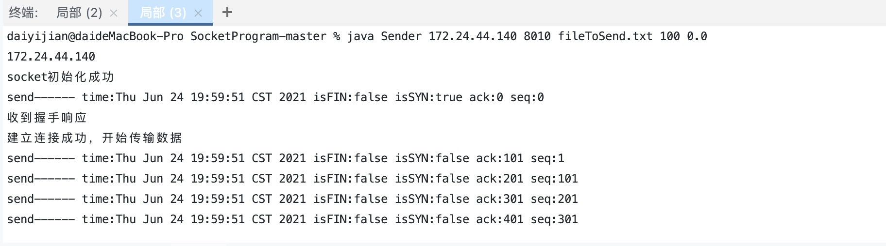

  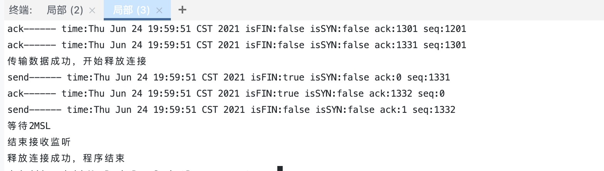

##### 设定一定丢包率

- 发送端

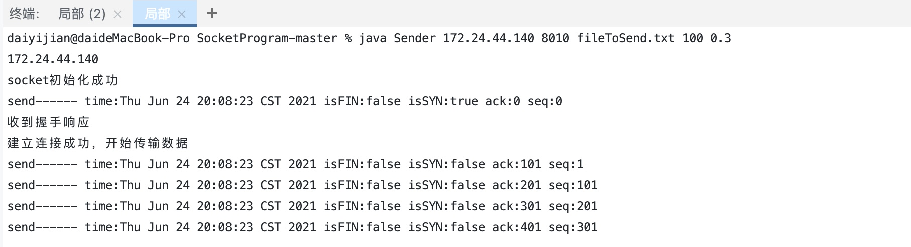

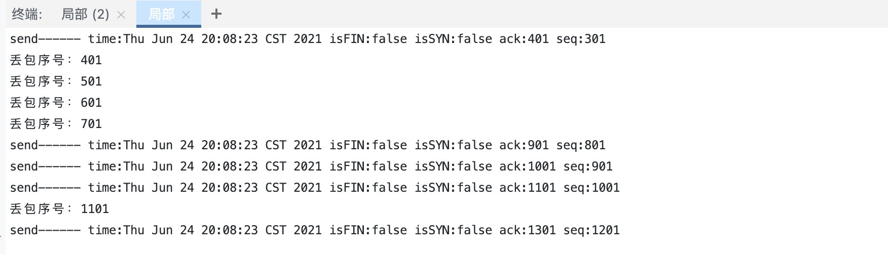

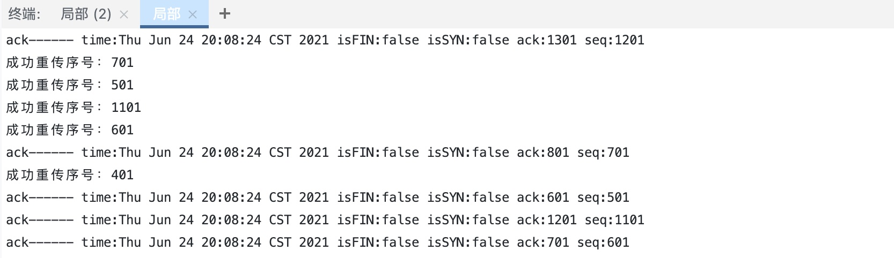

- 接受端

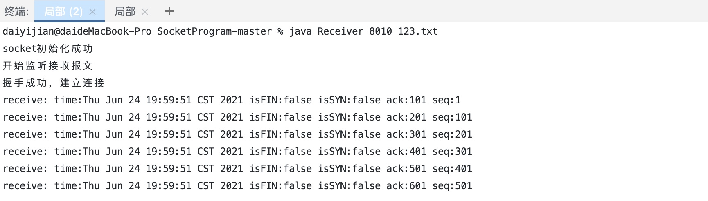

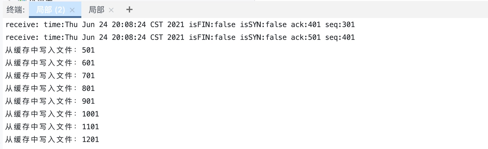

**当我们把丢包率调高时，接受到的文件会很明显地缺失**

- 设置丢包率0.6

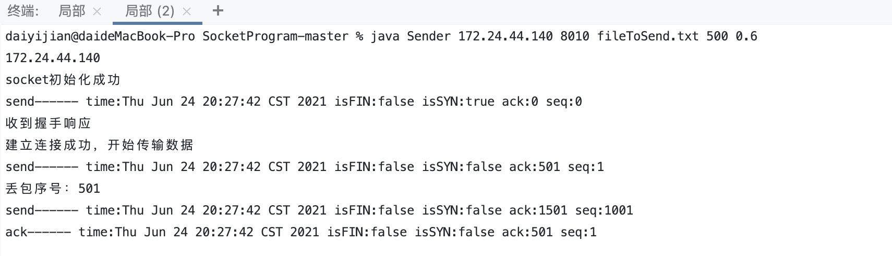

- 原文件

  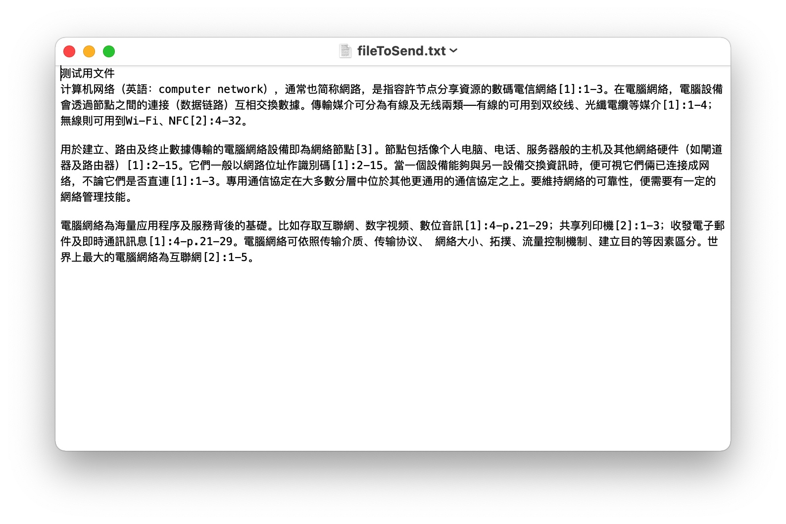

- 接受到的文件

  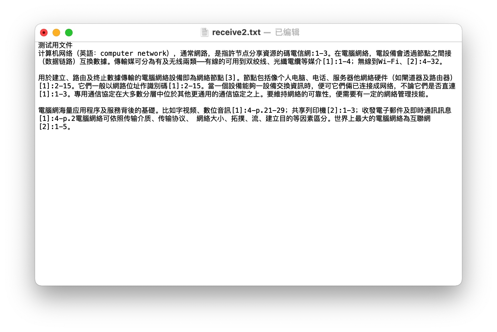